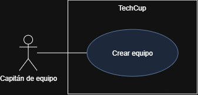
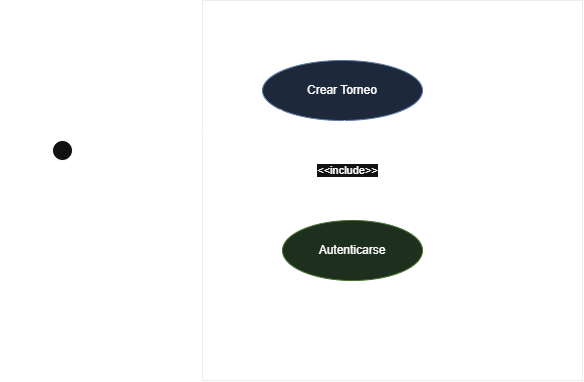
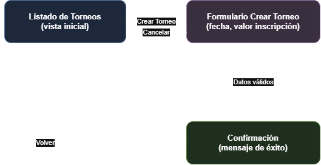
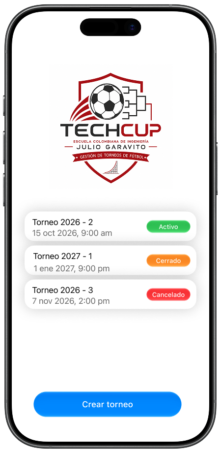
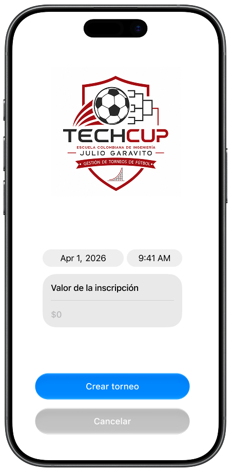
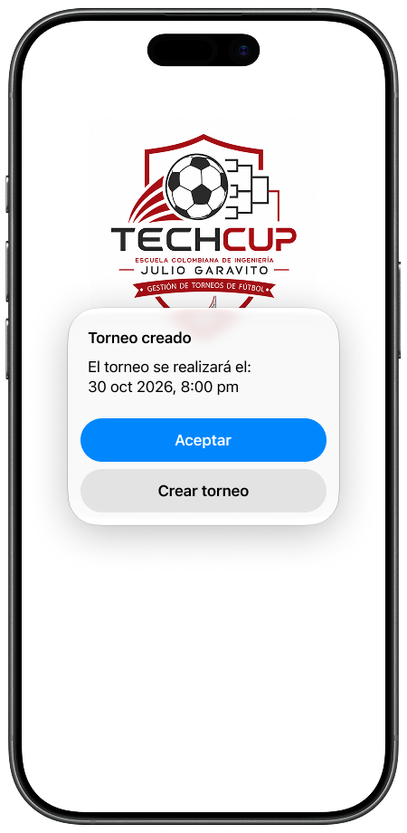
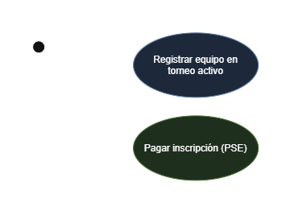

# 📄 Requerimientos del Sistema

## 1. Lista general de requerimientos
El sistema de TechCup tiene los siguientes requerimientos (descripción a alto nivel):

### 1.1 Requerimientos funcionales
El sistema de TechCup debe tener la capacidad de:
1. Permitir a los organizadores crear un torneo especificando sus reglas básicas, como fechas y valor de la inscripción.
2. Permitir a los organizadores generar un reporte de los equipos registrados en un torneo.
3. Permitir a los capitanes crear un equipo, especificando su información básica.
4. Permitir a los capitanes registrar su equipo únicamente en el torneo que se encuentre actualmente activo.
5. Permitir a los capitanes procesar el pago de la inscripción de su equipo a través de PSE, a los organizadores validar y aprobar dicho pago antes de confirmar el registro del equipo en el torneo.
6. Permitir a los organizadores cambiar el estado de un torneo (Pending, Active, In Progress, Closed o Cancelled) según las reglas de negocio definidas, garantizando que las transiciones de estado sean válidas y consistentes.

### 1.2 Requerimientos no funcionales
El sistema de TechCup debe tener:
1. Garantía de que solo exista un torneo en estado "Activo" en un momento dado, de acuerdo con las reglas de negocio.
2. Generación del reporte de ingresos de inscripción en formato JSON para ser enviado a la Decanatura, siguiendo una estructura de datos consistente.
3. Garantía de que la información de pago de cada equipo se procese de forma segura al integrarse con PSE.
4. Validación de que un equipo no pueda registrarse en más de un torneo activo al mismo tiempo, de acuerdo con las reglas de negocio.
5. Garantía de que las credenciales de los usuarios (organizadores y capitanes) se almacenen y se validen de forma segura, mediante mecanismos de autenticación robustos (por ejemplo, cifrado de contraseñas y control de sesiones).
6. El sistema debe generar el reporte de equipos registrados y el reporte de ingresos de inscripción en un tiempo de respuesta razonable (5 segundos) incluso cuando el torneo tenga un alto número de equipos registrados, garantizando escalabilidad en la consulta de datos.

## 2. Diagramas de caso de uso

### 2.1 Requerimiento Funcional 1

| Campo | Descripción |
|------|-------------|
| **ID** | RF-01 |
| **Nombre del requerimiento** | Crear Equipo |
| **Descripción** | El sistema debe permitir a los capitanes crear un equipo, especificando su información básica: nombre del equipo, programa académico y datos de los integrantes. |
| **Precondiciones** | Para que el sistema cumpla con este requerimiento, el capitán debe estar autenticado en TechCup. |
| **Actor** | Capitán de Equipo |
| **Flujo principal** | 1. El capitán inicia la opción de crear un nuevo equipo. 2. El sistema solicita los datos básicos del equipo: nombre, programa académico y datos de los integrantes. 3. El sistema valida que el nombre del equipo no esté duplicado y que el número de integrantes cumpla el mínimo requerido. 4. El sistema registra el equipo, asociándolo al capitán autenticado. |
| **Diagrama de caso de uso** |  — [uc-crear-equipo.drawio](../uml/uc-crear-equipo.drawio) |
| **Poscondiciones** | Se espera como resultado que el equipo quede creado en el sistema, disponible para ser registrado posteriormente en un torneo activo. |

### 2.2 Requerimiento Funcional 2
| Campo | Descripción |
|------|-------------|
| **ID** | RF-02 |
| **Nombre del requerimiento** | Crear Torneo |
| **Descripción** | El sistema debe permitir a los organizadores crear un torneo especificando sus reglas básicas, como fechas y valor de la inscripción. |
| **Precondiciones** | Para que el sistema cumpla con este requerimiento, el organizador debe estar autenticado en TechCup. |
| **Actor** | Organizador del Torneo |
| **Flujo principal** | 1. El organizador inicia la opción de crear un nuevo torneo. 2. El sistema solicita los datos básicos del torneo: fecha y valor de la inscripción. 3. El sistema valida que el torneo no exceda la duración de un día y que su ID sea un número de cinco dígitos basado en el año y semestre. 4. El sistema registra el torneo en estado "Pending". |
| **Diagrama de caso de uso** |  — [uc-crear-torneo.drawio](../uml/uc-crear-torneo.drawio) |
| **Poscondiciones** | Se espera como resultado que el torneo quede creado en el sistema en estado "Pending", disponible para ser activado posteriormente por un organizador. |

### Flujo de navegación — Crear Torneo

El requerimiento "Crear Torneo" involucra 3 pantallas:

1. **Listado de torneos** (vista inicial) — muestra los torneos existentes y el botón "Crear Torneo".
2. **Formulario Crear Torneo** — solicita fecha del torneo y valor de inscripción.
3. **Confirmación** — mensaje de éxito tras crear el torneo.

**Flujo:**
- Listado de torneos → (clic "Crear Torneo") → Formulario Crear Torneo
- Formulario Crear Torneo → (datos válidos, clic "Crear Torneo") → Confirmación
- Formulario Crear Torneo → (clic "Cancelar") → Listado de torneos
- Confirmación → (clic "Volver") → Listado de torneos

 — [flujo-navegacion-crear-torneo.drawio](../images/flujo-navegacion-crear-torneo.drawio)

### MOCKUPS

[Firma mockup](https://www.figma.com/design/7XIHe7qCfyQ4XC9BkkwDSB/TechCup?node-id=0-1&t=xym7cuLTCsrOhzha-1)

### 2.3 Requerimiento Funcional 3

| Campo | Descripción |
|------|-------------|
| **ID** | RF-03 |
| **Nombre del requerimiento** | Registrar Equipo en Torneo Activo |
| **Descripción** | El sistema debe permitir a los capitanes registrar su equipo únicamente en el torneo que se encuentre actualmente en estado "Activo". |
| **Precondiciones** | Para que el sistema cumpla con este requerimiento, el capitán debe estar autenticado, el equipo debe existir previamente en el sistema y debe existir un torneo en estado "Activo". |
| **Actor** | Capitán de Equipo |
| **Flujo principal** | 1. El capitán selecciona la opción de registrar su equipo en un torneo. 2. El sistema muestra el torneo actualmente activo (si existe). 3. El sistema valida que el equipo no se encuentre ya registrado en otro torneo activo. 4. El capitán confirma el registro y procede al pago de la inscripción vía PSE. 5. El sistema confirma el registro del equipo una vez validado el pago. |
| **Diagrama de caso de uso** |  — [uc-registrar-equipo.drawio](../uml/uc-registrar-equipo.drawio) |
| **Poscondiciones** | Se espera como resultado que el equipo quede registrado en el torneo activo, con su estado de pago asociado (pendiente o confirmado). |

## 3. Preguntas
    1. ¿Identifican algún requisito que necesite ser detallado más a fondo? ¿Cuál(es)?
        Existen varios que quedan incompletos tal como están redactados:
        - El reporte de equipos registrados (RF-02 del listado) no especifica qué campos debe incluir ni en qué formato se entrega.
        - "Procesar la información de pago de forma segura al integrarse con PSE" (NF-03) es muy genérico: no dice qué estándar de seguridad debe cumplirse (cifrado en tránsito/reposo, tokenización, PCI-DSS, etc) ni qué pasa si PSE rechaza o no confirma el pago.
        - La validación de "torneo activo único" no aclara qué ocurre si un organizador intenta activar un segundo torneo mientras otro sigue activo.
    2. ¿Hay algún requisito que se contradiga con otro? ¿Cuál(es)?
        La regla de negocio establece que "los torneos no pueden ser eliminados", pero dentro de las funcionalidades generales se pide "Eliminar un torneo y sus equipos registrados", ambos no pueden cumplirse al mismo tiempo, hay que decidir cuál prevalece.
    3. Si tuvieran que priorizar los requisitos, ¿cuáles 2 requisitos deberían considerarse como los más importantes e implementarse en la primera iteración del proyecto?
        - Crear Torneo (RF-02): sin un torneo creado y activo, ninguna otra funcionalidad (crear equipo, registrar equipo, pagar, generar reportes) tiene sentido, debido a que es el punto de partida de todo el flujo.
        - Registrar Equipo en Torneo Activo: Es el corazón del valor de negocio del sistema (inscripciones) y además es donde vive la regla crítica de "un equipo solo puede estar en un torneo activo a la vez", la cual es central para la integridad de los datos.
    4. ¿Hay algún requisito que no debería implementarse?
        "Eliminar un torneo y sus equipos registrados", además de contradecir la regla de negocio del punto 2, eliminar históricos de torneos con pagos ya procesados genera riesgos de integridad de datos financieros (los reportes a Decanatura dependen de ese histórico). Debería reemplazarse por "Cancelar torneo" (cambio de estado), no por borrado físico.