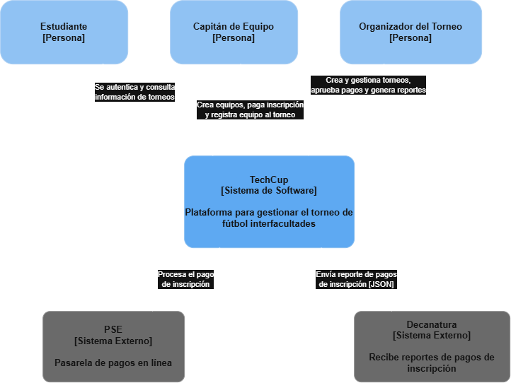

# 📄 Requerimientos del Sistema

## 1. Sistema
* Nombre del sistema: TechCup
* Objetivo: El sistema tiene como objetivo brindar una plataforma centralizada para la gestión del torneo de fútbol interfacultades organizado por la Escuela Colombiana de Ingeniería Julio Garavito, permitiendo la creación de torneos, el registro de equipos, el procesamiento y validación de pagos de inscripción, y la generación de reportes para los organizadores y la Decanatura.

## 2. Problema a resolver
< Describir el problema principal a resolver del Caso de Estudio>

## 3. Diagrama de Contexto

### 3.1 Diagrama

Diagrama fuente (editable): [c4-techcup.drawio](../uml/c4-techcup.drawio)

### 3.2 Actores
| Actor / Rol              | Descripción                                                                 |
|---------------------------|:----------------------------------------------------------------------------:|
| Estudiante                | Usuario del sistema que se autentica y consulta información de los torneos |
| Capitán de Equipo         | Crea equipos, realiza el pago de inscripción y registra su equipo al torneo activo |
| Organizador del Torneo    | Crea y gestiona torneos, revisa y aprueba pagos, y genera reportes |

### 3.3 Sistemas externos
| Sistema      | Descripción                                                                 |
|--------------|:----------------------------------------------------------------------------:|
| PSE          | Pasarela de pagos en línea utilizada para procesar el pago de inscripción de los equipos |
| Decanatura   | Recibe los reportes de pagos de inscripción en formato JSON generados por TechCup |

## 4. Alcance del sistema

### 4.1 Dentro del sistema
Funciones que el sistema sí realiza (Relacione al menos 4).

### 4.2 Fuera del sistema
Funciones que no realiza (Relacione al menos 3).